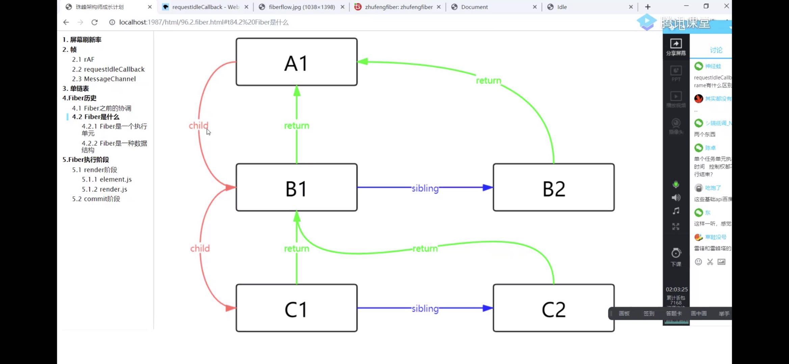

# 浏览器渲染

react filber 基础 浏览器API

1、 requestAnimateFrame
当浏览器刷新频率60hz/s时
每秒16hz

一诊干一个任务

输入事件===》 javascript ===》 begin frame(开始侦)

2、 requestldleCalback

filber通过requestldleCalback先分任务，执行一个任务后，完看看还有没有剩余时间，有就执行，没有就放弃执行，交给浏览器调度，等待下次执行。

核心：一个虚拟dom节点

3、 MessageChal

4、链表
单链表一种链式的数据结构
很多地方用到了链表

类似gennerate
generate性能交叉，而且低版本的polyfill的代码冗余

一个虚拟dom就是一个最小单元，超过16ms也没办法
这种调度方式叫合作式调度，需要浏览器相信用户写的代码
但是客户写的时候就写死循环，或者执行时间超过给的剩余时间，浏览器也没有办法

深度优先，类似二叉树深度遍历

协调，提交
这些Diff阶段可以中断
提交阶段 不可中断

虚拟dom会转成filber

链表实现了一个可中断的递归

react16用的filber
时间不够了，怎么找到的？先找到下一个单元，放弃执行，到了下一个单元再从上次结束的开始再

vue 不需要filber vue和react优化的思路不一样，
vue会把每个任务分隔的足够小，dom diff很快， 基于模版和watch，组件更新， 单节点更新，
更新范围很小

vue中 B节点更新， 就重新渲染B节点

react任务还是很大，但是会分隔成多个小任务，可以中断和恢复，不阻塞主进程，
react不管从哪里调setState，都从根节点开始对比

fiber解决了执行栈不能中断的问题
因为树太大了，需要暂停 解决卡顿  用sleep睡觉，代替大树

callback 时间回调

- 图片tree.jpeg
- 开始:A1
- 开始:B1
- 开始:C1
- 结束:C1
- 开始:C2
- 结束:C2
- 结束:B1
- 开始:B2
- 结束:B2
- 结束:A1
- render阶段结束了

明天
1、先写render写完 commit写完
2、从零实现一个filber版本的react
类组件、函数组件、useReducer
原声组件
setState
都可以实现

